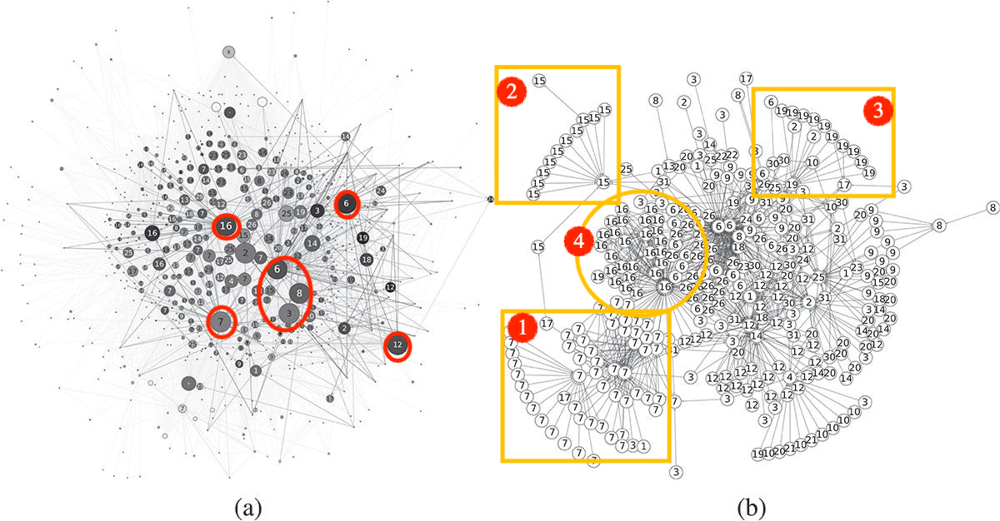
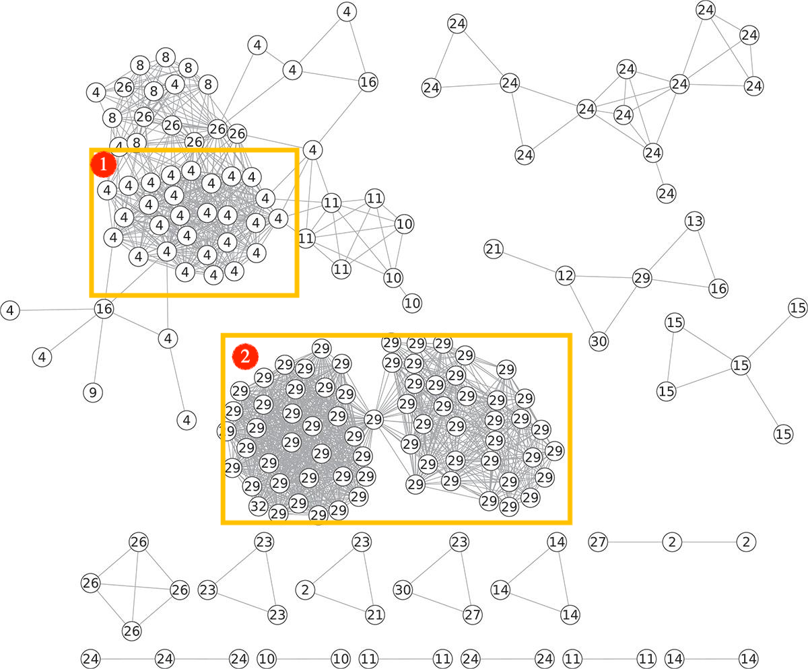

# How to Run a Disinformation Campaign

## 1.Introduction

In 2012 South Korea, National manipulate presidential election by operating fake contents on tweeter. Agents of the National Intelligence Service posted their tweeter to influence public opinion in favor of Geun-hye Park. This caimpaign was profesionally organized. Agents were native and well-knowledged pepeople, and adjusted their post daily to the changing election conditions. The public was fooled and only few suspected.

## 2.Behavior Pattern of South Korean Disinformation Campaign

### 2.1 Timing Pattern

Figure 1 illustrates the temporal behavior of NIS accounts compared to regular users. The differences reveal a structured, workday schedule pattern—suggesting the activity was carried out by agents operating on assigned schedules rather than ordinary social media users.

-	From panel (a)we can clearly observe that NIS accounts were more active during regular working hours, while their activity dropped significantly after office hours. In contrast, regular users were more active after working hours.

-	From panel (b) shows NIS activity drops sharply on Saturdays and Sundays, while regular users actually become more active.

-	From panel ( c ) suggests the NIS tweet suddenly stop their tweeting after they were discovered on December 11.

> By using the office-hour activity pattern, the researchers were able to identify and validate 824 additional suspicious NIS accounts.

### 2.2 Message Amplification Strategies

#### 2.2.1 Retweeting Within the Network

Retweeting means one account retweet within same group or agent. Retweeting is up to 48% in all NIS accounts. The density and darkness of connections in the retweet network highlight this varied pattern—some agents showed strong internal coordination, while others retweeted inconsistently.

From panel (a), the larger nodes represents the accountreceived more retweets  from other NIS accounts; the darker it appears, the higher the percentage of its retweets within the NIS network. This structure reveals targeted amplification rather than organic engagement.

From panel (b), we can see more clear srtucture of the retweeting strategy. From clusters(highlighted in yellow), the agents 7, 15, 16 and 19 created one or two central accounts, retweeting within themselves. While other agents show a coordinated strategy, retweeting each other.

#### 2.2.2 Co-tweeting: Copy-Paste Original Tweets

Co-tweeting refers to multiple accounts posting identical original content within short time windows. The researchers found that 85% of these co-tweets appeared within one minute of each other, and 99% within one work day or  10 hours —suggesting highly disciplined timing. Nearly 45% of all original tweets (in research data) were non-unique.

Figure 3 reveal a mechanical posting  behavior: many NIS accounts posted exactly the same message within seconds. 

What’s more, agents appeared to operate independently. They coordinated within small clusters assigned to individual agents, rather than as a single large team. 
Figure 3 shows dense, isolated co-tweeting “pods” instead of one massive connected network. It’s the digital equivalent of a factory line: efficient, segmented, and repetitive.

>This copy-paste pattern became a powerful detection strategy: accounts that co-tweeted repeatedly and tightly clustered around known agents were flagged as highly suspicious. 

#### 2.2.3 Co-Retweeting: Coordinated Sharing of the Same Content

Co-retweeting occurs when multiple accounts retweet the same tweet within a short time window. Only 17% of retweets were unique—most were repeated. While more spread than co-tweets, 20% of co-retweets still happened within one minute, and 99% within a week.

As shown in Figure 4, after applying the same tight time window used for co-tweets nearly, all NIS agents and suspicious accounts engaged in co-retweeting, further reinforcing the idea of disciplined, large-scale coordination.

>Though 440 co-retweeters were flagged as bot-like after manual review, co-retweeting patterns helped narrow down potential campaign accounts.

### 2.3 Account creation Pattern

Suspicious accounts were created at the same time intervals as known NIS accounts.
From account age, Suspects are generally younger than regular users, indicating potential batch creation.

Both suspect and NIS accounts have user IDs clustered in batches, indicating coordinated creation (unlike the smoother distribution of regular users).

# 3. Misaligned Agents, Missed Impact

## 3.1 Limited Persuasion in South Korea 

The South Korean disinformation campaign was highly coordinated but overly rigid. Agents followed fixed office schedules, used copy-paste tweets, and lacked creative input. With limited incentives and a reliance on traditional text-based posts, the campaign failed to engage audiences persuasively. Its limited impact reflects a classic principal-agent problem.

## 3.2 A Similar Structure in Russia’s IRA Campaign
This kind of misalignment between principal and agent is not unique. As Josephine Lukito (2019) shows, the Russian Internet Research Agency exhibited a similar dynamic: agents received centrally assigned tasks every morning, were required to meet daily quotas, and were evaluated based on engagement metrics. However, the assembly-line structure left little room for strategic creativity, leading to persistent goal misalignment.

## 3.3  Memes as a strategy
Mihăilescu (2024) shows how memes serve as a more interactive, efficient, and emotionally persuasive form of political communication. By drawing on shared cultural references and humor, they engage audiences emotionally, foster participation, and amplify political narratives.

##  3.4 India’s Hybrid Model
The 2019 Indian general election offers offers a more dynamic, hybrid campaign configuration. The Bharatiya Janata Party (BJP) adopted a hybridstrategy that combined centralized coordination with decentralized, volunteer-driven execution. This approach relied heavily on loosely connected WhatsApp groups, enabling broader participation and greater adaptability. As a result, the BJP was able to sustain a “permanent campaign” at low cost.

## Reference:

[Lukito, J. (2019). Coordinating a Multi-Platform Disinformation Campaign: Internet Research Agency Activity on Three U.S. Social Media Platforms, 2015 to 2017. Political Communication, 37(2), 238–255.](https://doi.org/10.1080/10584609.2019.1661889)

[Maurice Jakesch, Kiran Garimella, Dean Eckles, and Mor Naaman. 2021. Trend Alert: A Cross-Platform Organization Manipulated Twitter Trends in the Indian General Election. Proc. ACM Hum.-Comput. Interact. 5, CSCW2, Article 379 (October 2021), 19 pages.]( https://doi.org/10.1145/3479523)

[Mihăilescu, M.-G. (2024). Never Mess With the “Memers”: How Meme Creators Are Redefining Contemporary Politics. Social Media + Society, 10(4).]( https://doi.org/10.1177/20563051241296256 (Original work published 2024))

[Keller, F. B., Schoch, D., Stier, S., & Yang, J. (2019). Political Astroturfing on Twitter: How to Coordinate a Disinformation Campaign. Political Communication, 37(2), 256–280.](https://doi.org/10.1080/10584609.2019.1661888)

